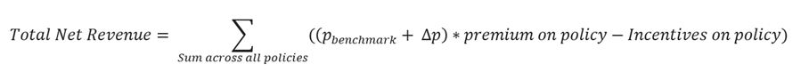
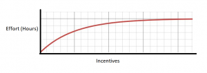
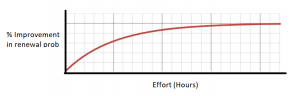

## McKinsey Hackathon - Insurance Renewal

**[Note: The problem is solved only partially. That is part A is solved. Didn't know how to proceed with Part B of the problem statement.]**

## About McKinsey Analytics Online Hackathon

During our online Hackathon, you will get a glimpse at the sort of problems and challenges that our McKinsey data scientists solve on a daily basis. The winner will receive a NIPS conference ticket and 5,000 USD for personal expenses. The best participants may also be invited for interviews with McKinsey Analytics. 

## Problem Statement

Your client is an Insurance company and they need your help in building a model to **predict the propensity to pay renewal premium** and **build an incentive plan for its agents to maximise the net revenue** (i.e. renewals - incentives given to collect the renewals) collected from the policies post their issuance.

 You have information about past transactions from the policy holders along with their demographics. The client has provided aggregated historical transactional data like number of premiums delayed by 3/ 6/ 12 months across all the products, number of premiums paid, customer sourcing channel and customer demographics like age, monthly income and area type.

 In addition to the information above, the client has provided the following relationships:

1. Expected effort in hours put in by an agent for incentives provided; and
2. Expected increase in chances of renewal, given the effort from the agent.

 Given the information, the client wants you to predict the propensity of renewal collection and create an incentive plan for agents (at policy level) to maximise the net revenues from these policies.

 

## EVALUATION CRITERIA

Your solutions will be evaluated on 2 criteria:

1. The base probability of receiving a premium on a policy without considering any incentive
2. The monthly incentives you will provide on each policy to maximize the net revenue 

### Part A:

The probabilities predicted by the participants would be evaluated using AUC ROC score.

### Part B:

The net revenue across all policies will be calculated in the following manner:

- $p_{benchmark}$ is the renewal probability predicted using a benchmark model by the insurance company

- ∆p (% Improvement in renewal probability*$p_{benchmark}$) is the improvement in renewal probability calculated from the agent efforts in hours

- ‘Premium on policy’ is the premium paid by the policy holder for the policy in consideration

- ‘Incentive on policy’ is the incentive given to the agent for increasing the chance of renewal (estimated by the participant) for each policy

> ProTip: p_benchmark is decided by the company. You can consider it as the best solution for the problem. More accurate your model, closer you are to the p_benchmark.

 The following curve provide the relationship between extra effort in hours invested by the agent with Incentive to the agent and % improvement in renewal probability vs agent effort in hours.

1. Relationship b/w Extra efforts in hours invested by an agent and Incentive to agent. After a point more incentives does not convert to extra efforts.

	

	Equation for the effort-incentives curve: Y = 10*(1-exp(-X/400))

2. Relationship between % improvement in renewal probability vs Agent effort in hours. The renewal probability cannot be improved beyond a certain level even with more efforts.

	

	Equation for the % improvement in renewal prob vs effort curve: Y = 20*(1-exp(-X/5))

*Note: The client has used sophisticated psychological research to arrive at these relationships and you can assume them to be true.*

### Leaderboard Ranking

Overall Ranking at the leaderboard would be done using the following equation:

Combined Score = w1*AUC-ROC value + w2*(net revenue collected from all policies)*lambda

Where -

w1 = 0.7

w2 = 0.3

lambda is a normalizing factor

 

### Public and Private Split:

Public leaderboard is based on 40% of the policies, while private leaderboard will be evaluated on remaining 60% of policies in the test dataset.

### Data

#### train.csv

It contains training data for customers along with renewal premium status (Renewed or Not?)

| **Variable**                     | **Definition**                                               |
| -------------------------------- | ------------------------------------------------------------ |
| id                               | Unique ID of the policy                                      |
| perc_premium_paid_by_cash_credit | Percentage of premium amount paid by cash or credit card     |
| age_in_days                      | Age in days of policy holder                                 |
| Income                           | Monthly Income of policy holder                              |
| Count_3-6_months_late            | No of premiums late by 3 to 6 months                         |
| Count_6-12_months_late           | No  of premiums late by 6 to 12 months                       |
| Count_more_than_12_months_late   | No of premiums late by more than 12 months                   |
| application_underwriting_score   | Underwriting Score of the applicant at the time of application (No applications under the score of 90 are insured) |
| no_of_premiums_paid              | Total premiums paid on time till now                         |
| sourcing_channel                 | Sourcing channel for application                             |
| residence_area_type              | Area type of Residence (Urban/Rural)                         |
| premium                          | Monthly premium amount                                       |
| renewal                          | Policy Renewed? (0 - not renewed, 1 - renewed                |

#### test.csv

Additionally test file contains premium which is required for the optimizing the incentives for each policy in the test set.

| **Variable**                     | **Definition**                                               |
| -------------------------------- | ------------------------------------------------------------ |
| id                               | Unique ID of the policy                                      |
| perc_premium_paid_by_cash_credit | Percentage of premium amount paid by cash or credit card     |
| age_in_days                      | Age in days of policy holder                                 |
| Income                           | Monthly Income of policy holder                              |
| Count_3-6_months_late            | No of premiums late by 3 to 6 months                         |
| Count_6-12_months_late           | No  of premiums late by 6 to 12 months                       |
| Count_more_than_12_months_late   | No of premiums late by more than 12 months                   |
| application_underwriting_score   | Underwriting Score of the applicant at the time of application (No applications under the score of 90 are insured) |
| no_of_premiums_paid              | Total premiums paid on time till now                         |
| sourcing_channel                 | Sourcing channel for application                             |
| residence_area_type              | Area type of Residence (Urban/Rural)                         |
| premium                          | Monthly premium amount                                       |

#### sample_submission.csv

Please submit as per the given sample submission format only

| **Variable** | **Definition**                 |
| ------------ | ------------------------------ |
| id           | Unique ID for the policy       |
| renewal      | Predicted Renewal Probability  |
| incentives   | Incentives for agent on policy |

 